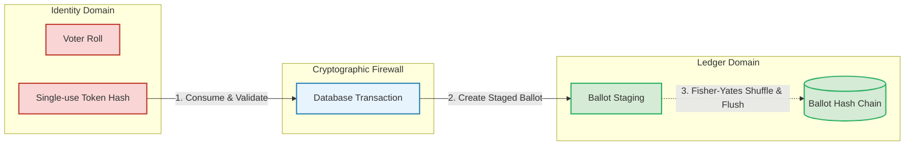
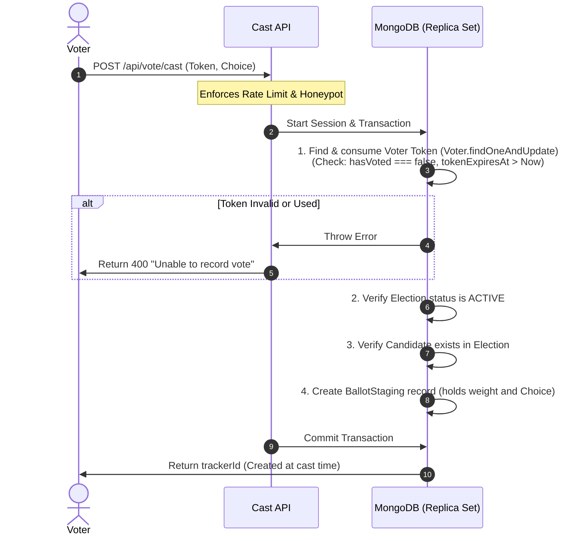

# SikkerValg — System Architecture

SikkerValg is a cryptographically verifiable, digital election platform designed for workplace and board elections. The core architectural challenge it solves is satisfying two conflicting requirements:
1. **Verifiability:** Proving that only eligible voters voted, exactly once, and that all cast votes are counted correctly.
2. **Anonymity:** Guaranteeing that no one (including system operators and database administrators) can correlate a cast ballot back to the voter who cast it.

This document describes the architectural patterns, data flow, and cryptographic controls implemented to guarantee both.

---

## 1. Architectural Philosophy: The Cryptographic Firewall

SikkerValg establishes a structural barrier between the **Voter Roll** (who you are) and the **Ledger** (what you voted).

---

## 2. Core Components & Data Schema

### 2.1 Identity Domain (Voter Schema)
*   **Voter:** Represents an individual eligible voter. 
    *   `email`: Stored encrypted at-rest using Field-Level Encryption (AES-256-GCM).
    *   `weight`: Statutory vote weight (either `0.5` or `1.0`).
    *   `hasVoted`: Boolean flag.
    *   `tokenHash`: SHA-256 hash of the one-time magic-link token.
*   *Anonymity Rule:* The `Voter` schema contains **no foreign keys or relationships** referencing the `Ballot` collection.

### 2.2 Ledger Domain (Ballot Schema)
*   **BallotStaging:** Temporary holding collection. Stores votes in their raw cast order temporarily before they are flushed.
*   **Ballot:** The permanent, append-only election ledger.
    *   `electionId`: References the election.
    *   `candidateId` / `blank`: The vote choice.
    *   `weight`: Copied from the voter's record at cast time.
    *   `trackerId`: A cryptographically random receipt (e.g., `TRK-89A2-BC4D`) generated at cast time and shown *once* to the voter.
    *   `prevHash`: Hash of the preceding ballot in the chain.
    *   `hash`: SHA-256 hash of this ballot's payload joined with `prevHash`.

---

## 3. Core Protocols & Transaction Flows

### 3.1 Cast Vote Protocol (Atomic Double-Write)
To guarantee a vote is never lost, the consumption of the voter's token and the creation of their ballot must succeed or fail together. This is handled via a **MongoDB multi-document transaction session**:

---

### 3.2 Ballot Sweeping Protocol (Decoupling Timestamps)
If ballots were written to the ledger immediately, an observer could correlate a voter update (visible in real-time) with a new ledger row by matching timestamps. 

To solve this, SikkerValg sweeps ballots in batches:
1.  **Staging:** Votes land initially in `BallotStaging`.
2.  **Cron Trigger:** A scheduled Vercel Cron triggers the `/api/cron/flush-ballots` route.
3.  **Shuffle:** The system pulls all pending records for an election and shuffles them using the **Fisher-Yates algorithm**. This completely destroys arrival/time order.
4.  **Chaining:** The shuffled records are written sequentially to the main `Ballot` collection, with each ballot's `hash` binding to the previous ballot's `hash`:
    $$H_n = \text{SHA-256}(H_{n-1} + \text{Payload}_n)$$
5.  **Clean up:** The staging records are deleted.

---

### 3.3 Election Closing Protocol (Zero-Loss Guarantee)
To close the election safely without losing concurrent votes or causing inconsistencies:
1.  **Transaction Start:** Start a session transaction.
2.  **Status Change:** Change the election status from `ACTIVE` to `CLOSED`. This instantly blocks any new incoming votes from executing their transactions.
3.  **Flush Remaining:** Run `flushPendingBallots` within the session transaction to flush any remaining votes in staging.
4.  **Tally & Freeze:** Count the weights in the `Ballot` collection, apply the de-anonymization safety roundings (rounding single 0.5-weight buckets to 1.0), and freeze the tally directly in the `Election` document.
5.  **Commit:** Commit the transaction.

---

## 4. Cryptographic Integrity & Verifiability

### 4.1 Ledger Integrity (Hash Chain)
Because each ballot links to the hash of the one before it, the ledger forms a blockchain:
$$\text{Ballot}_n.\text{hash} = \text{SHA-256}(\text{Ballot}_{n-1}.\text{hash} + \text{Payload}_n)$$
If a database administrator alters any historical ballot (e.g. changes a candidate ID), it will invalidate the hash of that ballot and break every single hash that follows it.

### 4.2 Verifiable Tally (Valgprotokoll PDF)
Once the election is closed, the final PDF protocol is generated:
1.  The PDF contains the list of candidates, final tally, and the hash of the final ballot in the chain (`ledgerHead`).
2.  The server hashes the PDF buffer and signs it using an **RSA-PSS keypair** (SHA-256).
3.  The signed bytes, hash, and signature are stored in the database.
4.  Anyone holding the PDF can independently verify the signature using the platform's public key, confirming the record hasn't been altered.

---

## 5. Security & Privacy Hardening

*   **Field-Level Encryption (FLE):** Voter email fields are stored encrypted in the DB. The IV is generated deterministically from the email plaintext, allowing duplicate checks on CSV upload without decrypting rows.
*   **CSRF Middleware:** The `/api/*` middleware validates the `Origin` and `Referer` headers on all state-changing requests, matching them against the configured `APP_URL`.
*   **PII Shredding:** A nightly cron job sweeps elections closed more than 30 days ago and shreds voter names, email ciphertexts, and token hashes, keeping only the anonymous vote counts and ledger.
*   **Rate Limits:** MongoDB-backed rate limits prevent credential stuffing and token guessing. Limiter upserts handle concurrent write errors to prevent uptime crashes.
*   **Zod Safety:** All mutating API endpoints parse incoming JSON payloads using Zod schemas to block structural hacks at the boundary.
